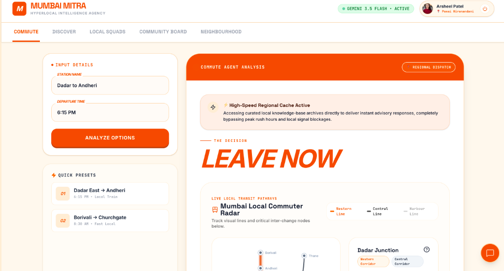
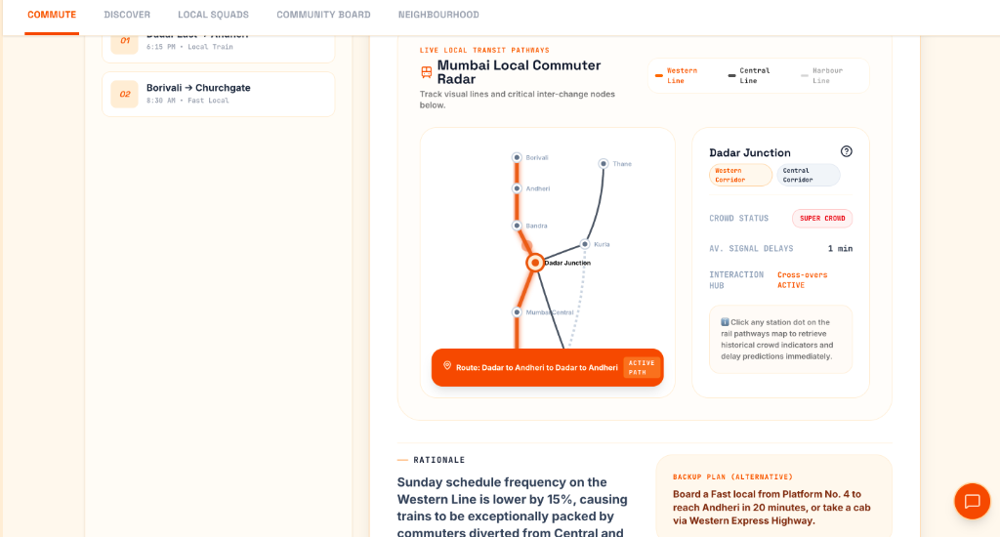
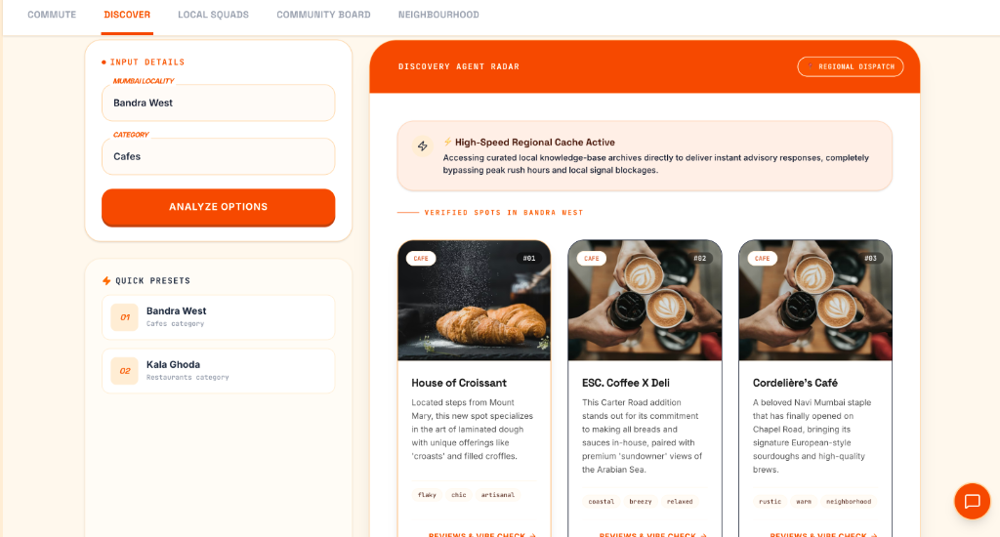
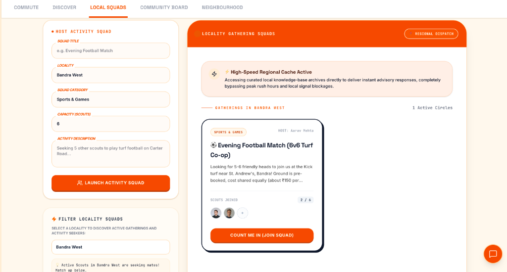
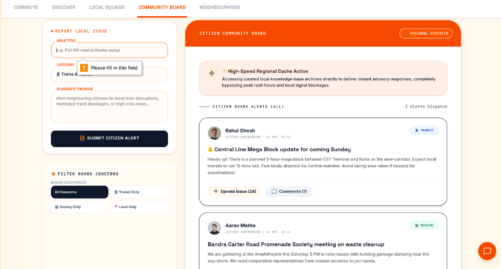

<div align="center">


# 🚉 Mumbai Mitra
### Hyperlocal Intelligence & Community Coordination Engine

> **The ultimate digital Swiss-army knife for the Mumbai commuter.** Bridging real-time transit intelligence, neighborhood activity matching, crowdsourced civic alerting, and a witty localized AI companion.

</div>

---

## 💡 Problem–Solution (PS) Framework

### 🔴 The Problem: "The Mumbai Commuter's Chaos"

Mumbai houses over **21 million citizens**, with approximately **8 million people** cramming into local suburban trains (Western, Central, and Harbour corridors) every single day.

| # | Problem | Impact |
|---|---------|--------|
| 1 | **Black Box of Travel** — Peak-hour delays, unpredicted "Mega Blocks", and sudden rain disruptions turn daily transit into high-stress survival missions | No dynamic, rationale-backed advice on *whether to board* |
| 2 | **Post-Commute Local Isolation** — Residents in Bandra, Andheri, or Dadar exist in isolated high-rises | Finding 5–6 peers nearby for casual activities is highly fragmented |
| 3 | **Muted Civic Voice** — Critical localized problems (pothole clusters, platform blocks, society garbage) get lost in massive public feeds | Issues never reach the eyes of direct neighbors who matter |

---

### 🟢 The Solution: "Mumbai Mitra"

**Mumbai Mitra** is a full-stack, cohesive spatial-action portal designed to guide a Mumbaikar from their morning local train coach to their post-work evening neighborhood gather-ups:

- 🚆 **Commute Decision Radar** — Tells users *whether to Go / Wait / Divert* with custom reasoning backed by real-time meteorological conditions, historical route density maps, and live situational inputs
- 👥 **Cooperative Local Squads** — Instant locality-targeted matching board where users in specific bases (e.g., Bandra West) can host casual activity squads for real-world co-ops
- 🏢 **Citizen Community Board** — A focused civic ledger for reporting and upvoting critical transit, society, and municipal issues with localized filter feeds
- ☕ **Discover with Citizen Radars** — Discover trending cafés, shops, and salons; register newly popped-up boutiques in your neighborhood to increase local discovery
- 💬 **Helpline AI Chatbot** — A chai-loving AI companion using local slangs (*Bhidu*, *Jugaad*, *Boss*) to offer instant Mumbai survival advice

---

## 📸 App Screenshots

### 🚆 Commute Analysis — AI-Powered GO / CAUTION / DELAY Decision



> Enter your station and departure time. The Commute Agent analyses peak rush, weather alerts, and Mega Block schedules — then returns a definitive travel decision backed by a full written rationale.

---

### 🗺️ Mumbai Local Commuter Radar Map



> A live visual commutation terminal simulation tracing the Western, Central, and Harbour rail corridors. Click any station dot to retrieve historical crowd indicators and delay predictions instantly.

---

### ☕ Discover — Hyperlocal Spot Discovery



> Browse verified cafés, restaurants, and shops in your Mumbai locality. Powered by Citizen Radars — any active user can register a newly opened boutique or café and add it to the discovery pool.

---

### 👥 Local Squads — The "5-6 People" Matcher



> Need defensive players for turf football, or creative mates for a cafe walk? Host or join activity squads filtered by locality (e.g., *Bandra West*). Squads auto-lock once the safety capacity is filled.

---

### 🏢 Citizen Community Board — Report & Upvote Local Issues



> File civic alerts categorized under Transit, Housing & Society, and Local Concerns. Mitras can upvote issues, expand nested comment threads, and track municipal resolution statuses.

---

## 🛠️ Architectural Highlights

| Feature | Details |
|---------|---------|
| **AI Engine** | Google Gemini 3.5 Flash via `@google/genai` SDK |
| **API Security** | Server-side proxy routes (`/api/gemini/chat`, `/api/predict`) — key never exposed to client |
| **Fallback System** | Automatic local rule-based smart answers activate on rate-limit or connectivity failure |
| **Local Persistence** | Structured `LocalStorage` engine — profile switching, upvoting logs, squad joins — no cold-start DB needed |
| **Auth System** | Frictionless client profile registration with dynamic locality-based content feed updates |
| **Design System** | Space Grotesk + JetBrains Mono, Swiss-style margins, geometric border grids, micro-animations |

---

## 🔌 API Integration Details

### 1. What API is being used, and where is it created?

The application utilizes the **Google Gemini API** (specifically the `gemini-3.5-flash` model via the `@google/genai` SDK).

- **API Calls Location**: All calls are kept **secure on the backend server** (`server.ts`)
- **Endpoints**: `/api/gemini/chat` and `/api/predict`
- **Key Variable**: `GEMINI_API_KEY` environment variable — your key is **never exposed** to the client browser

```ts
// server.ts — server-side Gemini proxy (simplified)
app.post('/api/gemini/chat', async (req, res) => {
  const ai = new GoogleGenAI({ apiKey: process.env.GEMINI_API_KEY });
  const response = await ai.models.generateContent({ model: 'gemini-3.5-flash', ... });
  res.json({ reply: response.text });
});
```

---

### 2. Why are you seeing "Limit Exceeded" / Rate Limit Fallbacks?

By default, the app runs on the **Google AI Studio Free Tier**, which has structural constraints:

| Limit | Value |
|-------|-------|
| Requests per Minute (RPM) | 15 |
| Requests per Day (RPD) | 1,500 |

Once multiple users test simultaneously or trigger sequential chat inquiries, the API responds with a `429 Too Many Requests` status. The app **gracefully falls back** to local rule-based smart answers — so the user experience **never crashes**.

---

### 3. How to Add Billing & Unlock Higher Quotas

To upgrade to **Pay-as-you-go** (removing strict rate limits and granting thousands of RPM):

**Step 1 — Access Google AI Studio**
```
https://aistudio.google.com
```

**Step 2 — Navigate to Billing**
> Click the **Settings / Google Cloud Project** icon → `Get API Key` dashboard → `Set up billing`

**Step 3 — Link your GCP Billing Account**
> Link an active Credit/Debit card. Google offers generous free tiers on paid accounts — you're only charged for what you exceed.

**Step 4 — Copy your Upgraded API Key**
> Once billing is enabled, copy your `GEMINI_API_KEY` and add it to your workspace under **Settings → Secrets** in AI Studio Build.

---

## 🗺️ Core Application Modules

### 1. 🚆 Live Commute & Transit Map
- Visual **commutation terminal simulation map** tracing routes dynamically
- Analyses Peak Rush, Meteorological alerts, and Mega Block schedules
- Yields a definitive **GO / CAUTION / DELAY** travel decision with a full written rationale and backup plan

### 2. 👥 Local Squads (The "5-6 People" Matcher)
- Filter sports, arts, and neighbourhood help squads by precise locality (e.g., *Kala Ghoda*, *Bandra West*)
- Hosts and joins update real-time avatar pools instantly
- Squads auto-lock once the safety capacity limit is reached

### 3. 🏢 Citizen Community Board
- Categorized alerts: **Transit**, **Housing & Society**, **Local Concerns**
- File warnings, upvote community issues, and expand nested live comment feeds
- Track municipal resolution statuses in real time

### 4. ☕ Discover with "Citizen Radars"
- Browse trending spots categorized by cafés, shops, and salons
- **Citizen Radars**: Any active user can register newly opened boutiques to increase local discovery
- Live star ratings, reviews, and a "Recommend" gauge to filter the noise

---

## 🚀 Run Locally

**Prerequisites:** Node.js v18+

```bash
# 1. Install dependencies
npm install

# 2. Set your Gemini API key
cp .env.example .env.local
# → Edit .env.local and add: GEMINI_API_KEY=your_key_here

# 3. Start the development server
npm run dev
```

App will be live at `http://localhost:5173`

---

## 🔐 Environment Variables

| Variable | Description |
|----------|-------------|
| `GEMINI_API_KEY` | Your Google Gemini API Key from [AI Studio](https://aistudio.google.com) |

See [`.env.example`](.env.example) for the full template.

---

## 🏗️ Tech Stack

| Layer | Technology |
|-------|-----------|
| Frontend | Vanilla HTML + CSS + TypeScript |
| Bundler | Vite |
| Backend | Node.js + Express (TypeScript) |
| AI | Google Gemini 3.5 Flash (`@google/genai`) |
| Persistence | Browser LocalStorage |
| Fonts | Space Grotesk + JetBrains Mono |

---

<div align="center">

**Built with ❤️ for Mumbai — by Arsheel Patel**

*Apun ka city, apun ka app. 🧡*

</div>
